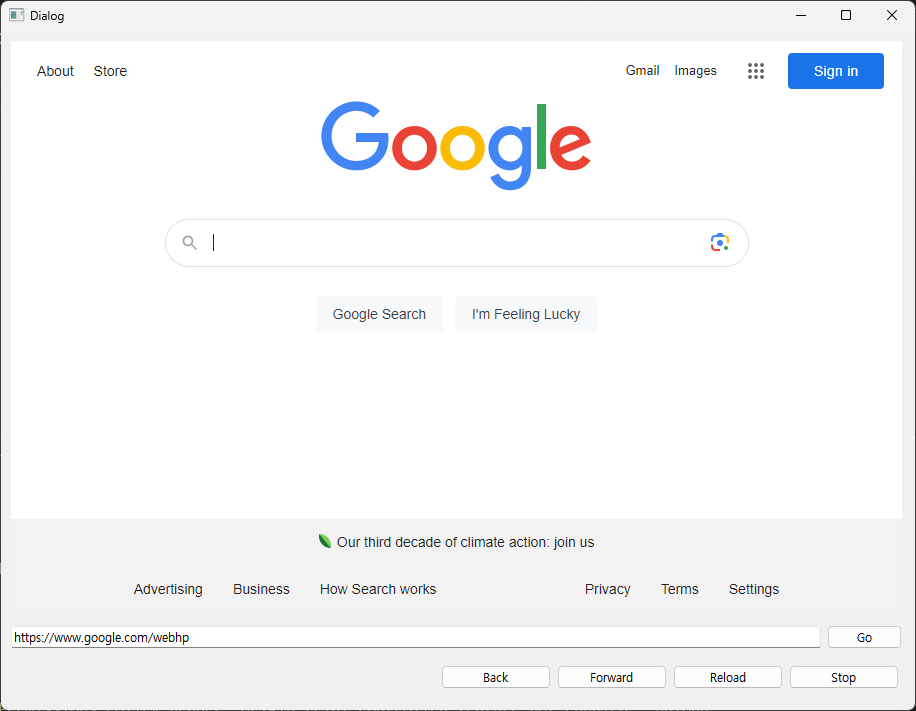

# PYQT Collection

My pyqt clllection

internet_qt.py

other thing is only test

## file list

* dh 
  * dh.png(logo)
  * DH.py(python code)
  * DH.ui(interface)
* web browser
  * internet_qt.py(python code)
  * internet.ui(interface)
* mole.py(chatgpt game)
* notepad 
  * note main.py(main python code)
  * notepad_mainwindow.py(ui to py)
  * notepad_mainwindow.ui(interface)
* notepad ver2
  * notepad.py(python code)
* QT practice
  * QT_1.py(test1)
  * QT_2.py(test2)
  * QT_3.py(test3)
  * QT_4.py(test4)
  * QT_5.py(test5)
 

## copyright
Copyright by © by @lamonlemon(jaewon song) All Right Reserves
